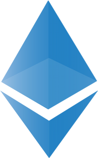

# My Wallet App 👔 🖥️

This is a simple web application that allows users to connect their wallet, check their account balance and wallet address, and transfer a token from the connected wallet to another address on the Goerli Ethereum network.

<table width="100%">
  <tr>
    <td align="center" valign="middle" width="20%">
      <a href="https://react.dev/">
        
      </a>
      <br />
      React
    </td>
    <td align="center" valign="middle" width="20%">
      <a href="https://www.ecma-international.org/publications-and-standards/standards/ecma-262/">
        
      </a>
      <br />
      JavaScript
    </td>
    <td align="center" valign="middle" width="20%">
      <a href="https://www.typescriptlang.org/">
        
      </a>
      <br />
      TypeScript
    </td>
    <td align="center" valign="middle" width="20%">
      <a href="https://vitejs.dev/">
        
      </a>
      <br />
      Vite
    </td>
    <td align="center" valign="middle" width="20%">
      <a href="https://ethereum.org/uk/">
      
      </a>
      <br />
      Ethereum
    </td>
  </tr>
</table>

## Installation and Usage ⚙️ 🚀 📅 💻

To get start application, follow these steps:

1.  Clone this repository to your local machine.
2.  Open the terminal and navigate to the project directory.
3.  Run the following commands:

```
# yarn package manager
yarn install
yarn start

# npm package manager
npm install
npm run start
```

Copy the repository to yourself

```shell
git clone https://github.com/BlackyHat/true-test.git
```

Also you need to install MetaMask as extension of your desktop browser.
For mobile devices you can install MetaMask app and latest version Google Chrome for correct working application.

##### Demo 🖥️ 🚀 📅 🏦

### [GO TO LIVE DEMO PAGE HERE ](https://my-wallet-app-99yy.onrender.com/) 👀 🌀 📙


## The web application using the following technologies and libraries: ⚙️ 🚧 🖥️

- JavaScript,
- TypeScript,
- React.js,
- Ethers.js,
- Formik,
- Yup,
- Moment,
- React Hot Toast,
- React Icons,
- React Load Spinners,
- SASS,

## Stay in touch 🤠 💼 🕔 🏁

- Author - [Oleksandr Podoliako](https://github.com/BlackyHat)
- Linkedin - [http://linkedin.com/in/oleksandr-vp](http://linkedin.com/in/oleksandr-vp)
- Telegram - [@blackhatty](https://t.me/blackhatty)
